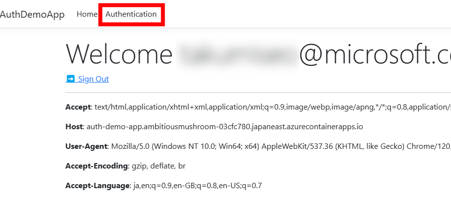
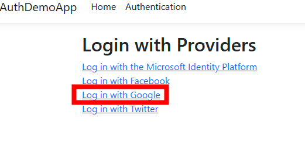

# Azure Container Apps で認証と認可
Azure Container Apps では 最小のコードまたはコードなしで外部からアクセスされるコンテナー アプリを保護するための組み込みの認証と認可機能 (Easy Auth とも呼ばれる) が用意されています。 
以下が現時点(2023 年 12 月 11 日)で対応しているプロバイダーになります。
+ [Microsoft Enta ID](https://learn.microsoft.com/ja-jp/azure/container-apps/authentication-azure-active-directory)
+ [Facebook](https://learn.microsoft.com/ja-jp/azure/container-apps/authentication-facebook)
+ [Github](https://learn.microsoft.com/ja-jp/azure/container-apps/authentication-github)
+ [Google](https://learn.microsoft.com/ja-jp/azure/container-apps/authentication-google)
+ [X](https://learn.microsoft.com/ja-jp/azure/container-apps/authentication-twitter)
+ [カスタム OpenID Connect](https://learn.microsoft.com/ja-jp/azure/container-apps/authentication-openid)

## 組み込みの認証を利用する利点
組み込みの認証機能を利用することで得られる利点に関しては以下の項目などが挙げられます。
* 認証 (サインイン ユーザー) と認可 (セキュリティで保護されたデータへのアクセスの提供) に対しての実装時間の軽減できます
* 最新の業界のベストプラクティスを保てます
* 特定の言語、SDK、セキュリティの専門知識、または記述する必要があるコードが必要がありません

## 機能のアーキテクチャと検証
### 機能のアーキテクチャ
認証と認可のコンポーネントはサイドカー パターンとして認証ミドルウェアがアプリケーションと同じレプリカ内にデプロイされます。 つまり全ての HTTP 要求はアプリケーションにたどり着く前にセキュリティ レイヤーを通過します。
> 似た仕様として [Azure App Service の認証機能](https://learn.microsoft.com/ja-jp/azure/app-service/overview-authentication-authorization#feature-architecture)があります。この場合はアプリケーションと同一の仮想マシン内に作成されます。

> サイドカー パターンとは、メインのコンテナの補助的な機能を提供するコンテナで構成されます。例えば、ログファイルを転送するコンテナなどが挙げれれます。

 
 

 
 
このプラットフォーム ミドルウェアは以下の処理をアプリに対して行います。

* 指定された ID プロバイダーを使用してユーザーを認証します
* プロキシとして動作します
* /.auth/* にレスポンスします
    * ログイン時に https://\<applicatoin url\>/.auth/login/\<provider name\> にリダイレクトします
* HTTPS の要求のみを許可します
* HTTP 要求ヘッダーに ID 情報を挿入します
    * X-MS-CLIENT-PRINCIPAL-NAME
    * X-MS-CLIENT-PRINCIPAL-ID
    * X-MS-CLIENT-PRINCIPAL-IDP
    * X-MS-CLIENT-PRINCIPAL

### 検証
今回参考にしているアプリケーションは[こちら](https://github.com/KamalRathnayake/MeetKamalToday./tree/main/95-container-apps-authentication/src/AuthDemoApp)です。 
今回の検証の流れは
<ol>
    <li>アプリケーションの認証に Microsoft Entra ID を用いる (任意のユーザー)</li>
    <li>アプリケーションの認証に Microsoft Entra ID を用いる (同じテナント内のユーザー)</li>
    <li>複数 ID プロバイダー (IDP) を用いた認証</li>
</ol>
です。

#### Step1: イングレスの設定
Azure Portal からイングレスの設定を開き、
イングレスの構成で「セキュリティで保護されていない接続」で**許可されていない**ことを確認します。理由としては、この機能は HTTPS のみで使用する必要があるためです。
 
 

 
 

#### Step2: Microsoft にアプリケーションを登録する
この手順では Microsoft を IDP として使用するように Azure Container Apps を構成します。 
設定の認証を開き「ID プロバイダーを追加」を選択します。
 
 

 
 

+ ID プロバイダーの追加より、「Microsoft」 を選択します
+ 「アプリの登録を新規作成する」を選択し、このアプリを IDP と関連付けます
+ アプリケーションの名前を決めます
+ サポートされているアカウントの種類で「任意の Microsoft Entra ディレクトリと個人用 Microsoft アカウント」を選択します。これにより任意の Micorosft アカウントでのログインが可能になります

>新規に作成すると、Azure Portal の Microsoft Entra ID の 「アプリの登録」から作成したアプリの詳細情報を確認することができます。Microsoft Entra ID からのアプリの登録の仕方は[こちら](https://learn.microsoft.com/ja-jp/training/modules/register-apps-use-microsoft-entra-id/)を参照してください。

 
 

 
 

+ アクセスを制限するで、「認証が必要」を選択します
+ 認証されていない要求は今回は「HTTP 302 リダイレクトが見つかりました: Web サイトに推奨」を選択します

 
 

 
 

補足として選択肢の一つのアクセス制限に関して確認します。 
ここではコンテナー アプリの認証設定を編集して、受信要求が認証されていない場合のさまざまな動作で構成できます。 以下ではそれらのオプションを説明します。

+ **認証されていないアクセスを許可する**: 認証されていないトラフィックの認可をアプリケーション コードに委任します。 認証された要求について、Container Apps は HTTP ヘッダーで認証情報も渡します。 アプリでは、ヘッダー内の情報を使用して、要求の認可を決定できます。 
このオプションではユーザーに複数のサインイン プロバイダーを提示することなどが可能になります。 ただし、**コードを記述する必要**があります。

+ **認証が必要**: 認証されていないとき、アプリケーションへのトラフィックを拒否します。 この拒否は、構成されているいずれかの ID プロバイダーへのリダイレクト操作になります。 このような場合は、選択したプロバイダーの /.auth/login/<PROVIDER> にブラウザー クライアントがリダイレクトされます。  
返される応答は HTTP 401 Unauthorized です。 すべての要求に対して HTTP 401 Unauthorized または HTTP 403 Forbidden になるように拒否を構成することもできます。 
このオプションを使用すると**コードを一切書き換える必要がありません**。

今回は「認証が必要」を選択しています。

+ 次に「アクセス許可」において、アプリケーションに必要なアクセス許可の種類を選択します
+ 今回は以下の画像のように設定します (後ほどアクセスした際にユーザーの同意の画面で動作を確認することができます)

 
 

 
 

+ アクセス許可の更新をクリックし、追加をクリックし、ID プロバイダーの追加を終えます

#### Step3: 動作の確認 

ID プロバイダーの追加が対象のアプリケーションにおいて終了したので、

+ 現在のテナント内のアカウントからのアクセス
+ 個人の Microsoft アカウントからのアクセス

の二通りを確認していきます。

まず現在のテナント内のアカウントからアクセスを試みます。

 
 

 
 

 
 

 
 
サインインページから認証を行い、Web ページに遷移することができました。 

次にプライベートブラウザを開いて (Ctrl + Shif + N)、個人アカウントでサインインを試みます。

 
 

 
 

サポートされているアカウントの種類で「任意の Microsoft Entra ディレクトリと個人用 Microsoft アカウント」を選択したため、個人用のアカウントでログインすることができました。 
X-MS-CLIENT-* の 4 つのヘッダーが追加されていることが確認でき、ログインに使用したメールアドレス、プロバイダー (aad) を確認することができます。

 
 

 
 

### Step4: 現在のテナント内のみからのアクセスに変更する
現在任意のアカウントでログインを可能にしているため、現在のテナント内 (例: 会社内) のアカウントのみログインが可能な仕様にしていきます。 

手順としては、まず Azure Portal 上の認証の設定に戻り ID プロバイダーの削除と、認証の削除を行ってください。 

ID プロバイダーの削除はこちらから。
 
 

 
 
認証の削除はこちらから。
 
 

 
 
残りの設定は、Step2 のサポートされているアカウントの種類を「現在のテナント - 単一テナント」として登録することのみが相違点です。
 
 

 
 
実際に 現在のテナント内のアカウントではない個人のアカウントの順でログインを試みます。
 
 

 
 

このように 「User account *@gmail.com does not exit in tenant *」と表示されサインインが失敗します。このようにしてアプリケーションの公開範囲を絞ることも可能です。

### Step5: 複数の IDP で認証をする

最後に Microsoft に加えて、 Google を IDP として追加し、認証の選択肢を追加します。 Google にアプリケーションを登録し、クライアント ID とクライアント シークレットを作成する方法は[こちら](https://developers.google.com/identity/sign-in/web/server-side-flow?hl=ja)を参照してください。 

クライアント ID とクライアント シークレットを控え、 Azure Portal に移動し、 Azure Container Apps の認証の画面に移動し、 ID プロバイダーにて、プロバイダーの追加をクリックします。
 
 

 
 
控えたクライアント ID とクライアント シークレットを入力します。スコープに関しては Google 側で設定を行うため、このまま追加します。
 
 

 
 
追加を終えたら、再度アプリケーションにアクセスし、右上部の「Authentication」を選択して、実際に Google アカウントでログインします。
 
 

 
 
Log in with Google を選択し、 Google でログインします。
 

 
 
ログインをするアカウントを選択し、続行します。
 

 
 

> (参考) Facebook でログインすると、IDP の登録をしていない為以下のような結果になります。

ログインをした Google アカウントが表示されていることが確認できます。

 

 
 
また追加されたヘッダーの X-MS-PRINCIPAL-IDP において 「google」と表示されていることから、IDP である Google を通して、認証を行ったことが確認できます。

 

 
 
 

Azure Container Apps の認証の機能の検証は以上です。
