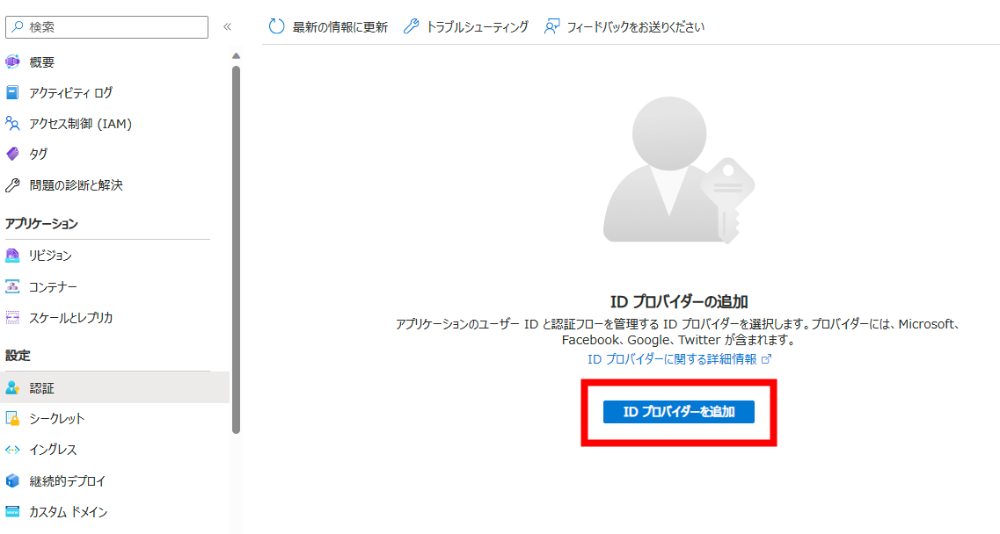

# Azure Container Apps で認証と認可
Azure Container Apps では 最小のコードまたはコードなしで外部からアクセスされるコンテナー アプリを保護するための組み込みの認証と認可機能 (Easy Auth とも呼ばれる) が用意されています。 
以下が現時点(2023 年 12 月 11 日)で対応しているプロバイダーになります。
+ [Microsoft Enta ID](https://learn.microsoft.com/ja-jp/azure/container-apps/authentication-azure-active-directory)
+ [Facebook](https://learn.microsoft.com/ja-jp/azure/container-apps/authentication-facebook)
+ [Google](https://learn.microsoft.com/ja-jp/azure/container-apps/authentication-google)
+ [X](https://learn.microsoft.com/ja-jp/azure/container-apps/authentication-twitter)
+ [カスタム OpenID Connect](https://learn.microsoft.com/ja-jp/azure/container-apps/authentication-openid)

## 組み込みの認証を利用する利点
組み込みの認証機能を利用することで得られ瑠璃点に関しては以下の項目などが挙げられます。
+ 認証 (サインイン ユーザー) と認可 (セキュリティで保護されたデータへのアクセスの提供) に対しての実装時間の軽減
+ 最新の業界のベストプラクティスを保てる
+ 特定の言語、SDK、セキュリティの専門知識、または記述する必要があるコードが必要ない

## 機能のアーキテクチャと実装
今回の Hands on では事前登録済みの Github アカウントを利用して、事前にデプロイしたアプリケーションのセキュリティを強化します。 
ここでは [Github にアプリケーションを登録する](https://learn.microsoft.com/ja-jp/azure/container-apps/authentication-github)を参照します。 
### 機能のアーキテクチャ
認証と認可のコンポーネントは各レプリカの上でコンテナーとして実行されます。つまり全ての HTTP 要求はアプリケーションにたどり着く前にセキュリティ レイヤーを通過します。
 
 

 
 
このプラットフォーム ミドルウェアは以下の処理をアプリに対して行います。

+ 指定された ID プロバイダーを使用してユーザーとクライアントを認証する
+ 認証されたセッションを管理する
+ HTTP 要求ヘッダーに ID 情報を挿入する

### 実装
#### Step1: イングレスの設定
Azure Portal からイングレスの設定を開き、
イングレスの構成で「セキュリティで保護されていない接続」で**許可されていない**ことを確認します。理由としては、この機能は HTTPS のみで使用する必要があるためです。
 
 

 
 
次に設定/認証を開き「ID プロバイダーを追加」を選択します。
 
 

 
 
ID プロバイダーの追加より、Github を選択します。 
まずは認可の動作に関して確認します。
 
 

 
 

コンテナー アプリの認証設定を編集して、受信要求が認証されていない場合のさまざまな動作で構成できます。 以下ではそれらのオプションを説明します。

+ **認証されていないアクセスを許可する**: 認証されていないトラフィックの認可をアプリケーション コードに委任します。 認証された要求について、Container Apps は HTTP ヘッダーで認証情報も渡します。 アプリでは、ヘッダー内の情報を使用して、要求の認可を決定できます。 
このオプションではユーザーに複数のサインイン プロバイダーを提示することなどが可能になります。 ただし、**コードを記述する必要**があります。

+ **認証が必要**: 認証されていないとき、アプリケーションへのトラフィックを拒否します。 この拒否は、構成されているいずれかの ID プロバイダーへのリダイレクト操作になります。 このような場合は、選択したプロバイダーの /.auth/login/<PROVIDER> にブラウザー クライアントがリダイレクトされます。  
返される応答は HTTP 401 Unauthorized です。 すべての要求に対して HTTP 401 Unauthorized または HTTP 403 Forbidden になるように拒否を構成することもできます。 
このオプションを使用すると**コードを一切書き換える必要がありません**。

今回は「認証が必要」を選択しています。

#### Step2: Github にアプリケーションを登録する
この手順では Github を認証プロバイダーとして使用するように Azure Container Apps を構成します。
Step2 の中の手順としては
<ol>
    <li>Github を開き「設定」をクリックします</li>
    <li>左側のサイドバーで [開発者設定] をクリックします</li>
    <li>左側のサイドバーで、 [OAuth apps] をクリックします</li>
    <li>[新しい OAuth アプリ] をクリックします</li>
    <li>[Application name] に、アプリケーションの名前を入力します</li>
    <li>[Homepage URL] に、Azure Container Apps の FQDN を入力します</li>
    <li>[Authorization callback URL] に、アプリケーションのコールバック URL を入力します - ＜アプリケーションのFQDN＞/.auth/login/github/callback</li>
    <li>Register application をクリックします</li>
</ol>
以上の手順を終えた画面が以下になります。
 
 

 
 

>任意ですが、アプリケーションのロゴも設定することができます。

登録をしたあと、Azure Portal の
 
 

 
 
赤枠内の「クライエント ID」と「クライエント シークレット」を入力するために、Github ページの「クライエント ID」をメモに控え、「クライエント シークレット」を生成して、こちらもメモに控えます。

 
 

 
 

>場合によって、Github の2段階認証になるのでサインインできるデバイスの準備が必要です。

#### Step3: Azure Portal で実装を終える
Azure Portal に戻り「クライエント ID」と「クライエント シークレット」を入力します。

 
 

 
 
最後に「追加」をクリックし、ID プロバイダーを追加します。
以上の Step を終えると、以下のように結果が確認できます。
 
 

 
 

### 確認
最後に自身のアプリケーションの FQDN に接続して Github による認証が適切に動いているか確認します。 
実際に接続すると以下の様に認証画面に遷移します。

 
 

 
 

認証を終えると、通常のアプリケーションの画面に遷移します。 
認証と認可の検証は以上です。
