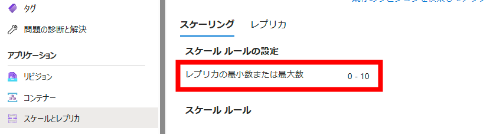

# Azure Container Apps のスケーリングの検証
ここでは、Azure Container Apps にデプロイされているアプリケーションのスケーリング機能を実験的に体験します。
またスケーリング設定の際の注意点も兼ねて記述しています。

## 1.事前準備
Azure ポータルで CLI を開くか、PowerShell を利用して操作します。
PowerShell を用いる場合、ご自身のサブスクリプションを以下に従って紐づけてください。
>本番環境にデプロイしないように必ず注意してください。
```
# Azure にログイン
az login
# 利用可能なサブスクリプションを表示
az account list --output table
# 現在利用中のサブスクリプションを表示
az account show
# もし異なる場合
az account set --subscription [SubscriptionId] 
```
CLI 用の Azure Container Apps の拡張機能をインストールまたは更新します。
また必要な名前空間を登録していきます。
```
# Azure Container Apps の拡張機能をインストール
az extension add --name containerapp --upgrade

# Azure サブスクリプションに Microsoft.App 名前空間と Microsoft.OperationalInsights 名前空間を登録
# 登録されているか確かめる
az provider list --query "[?namespace=='Microsoft.App' || namespace=='Microsoft.OperationalInsights'].{Provider:namespace, Status:registrationState}" --output table
```
実行結果の例
|   Provider   |   Status   |
|    ----      |    ----    |
|   Microsoft.App   | Registered |
| Microsoft.OperationalInsights  | Registered |

ここで NotRegistered の Provider に対しては以下のコマンドを実行してください
```
# Microsoft.App が登録されていない場合
az provider register --namespace Microsoft.App

# Microsoft.OperationInsights が登録されていない場合
az provider register --namespace Microsoft.OperationInsights
```
>[Azure のプロバイダー](https://learn.microsoft.com/ja-jp/azure/azure-resource-manager/management/azure-services-resource-providers)は特定の Azure サービスの機能を有効にする REST 操作セットを指します。 例えば、Key Vault サービスは Microsoft .KeyVault という名前空間のリソースプロバイダーで構成されています。

## スケールルールを追加する
az containerapp update コマンドを実行して, コンテナー アプリにHTTP スケール ルールを追加します。

スケーリングは、3 つの異なるカテゴリのトリガーによって実行されます。
+ [HTTP](https://learn.microsoft.com/ja-jp/azure/container-apps/scale-app?pivots=azure-portal#http): リビジョンに対して同時に実行できる HTTP 要求数に基づくスケーリング
+ [TCP](https://learn.microsoft.com/ja-jp/azure/container-apps/scale-app?pivots=azure-portal#tcp): リビジョンに対して同時に実行できる TCP 接続数に基づくスケーリング
+ [カスタム](https://learn.microsoft.com/ja-jp/azure/container-apps/scale-app?pivots=azure-portal#custom): CPU、メモリ、またはサポートされているイベント ドリブン データ ソースに基づいて、次のように示します
Azure Service Bus
Azure Event Hubs
Apache Kafka
Redis
複数のスケール ルールを定義すると、いずれかのルールの最初の条件が満たされたときにコンテナー アプリでスケーリングが開始されます。

ここから変数を設定し、update コマンドを実行し、ルールを追加します。</br>
アプリが複数の同時 HTTP 要求を受信した場合、ランタイムによって、要求を処理するアプリのレプリカが作成されます。
```
$appName = "<Azure Container Apps の Application 名>"
$rg= "<リソースグループ名>"
$scaleRuleName = "my-http-scale-rule"
$appFQDN = "<作成済みのアプリケーションの FQDN>"

# update コマンドの実行
az containerapp update `
  --name $appName `
  --resource-group $rg `
  --scale-rule-name $scaleRuleName `
  --scale-rule-http-concurrency 1
```
>--scale-rule-http-concurrencyは、Azure Container Apps のスケーリングルールの一部で、HTTP リクエストの同時接続数に基づいてコンテナアプリのスケーリングを制御します。</br>
具体的には、このパラメーターは、あるリビジョンに対する同時 HTTP リクエストの閾値を設定します。この閾値を超えると、新たなレプリカが追加されます。レプリカは最大レプリカ数に達するまでプールに追加され続けます。</br>
例えば、--scale-rule-http-concurrency 1と設定すると、1つのHTTPリクエストが来るたびに新たなレプリカが追加されます。

実行結果として、 update コマンドによって、要求が成功したことを確認するための JSON 応答として新しい構成が返されます。
<details>
<summary>実行結果の一部（ここをクリックして開く）</summary>

```
"scale": {
        "maxReplicas": 10,
        "minReplicas": 0,
        "rules": [
          {
            "http": {
              "metadata": {
                "concurrentRequests": ""
              }
            },
            "name": "my-http-scale-rule"
          }
        ]
      },
```

</details>
正しく反映されていると、scale.rules.name の値に my-http-scale-rule が反映されます。
Azure ポータルでは以下のように追加したルールを確認することができます。
<BR>
<BR>

<BR>
<BR>

## ログを出力する
Container Apps ランタイムによって生成されたログを表示することで、アプリケーションのスケーリングの効果を確認できます。</br>
az containerapp logs show コマンド を使用して、ログ エントリのリッスンを開始していきます。

```
az containerapp logs show `
--name $appName `
--resource-group $rg `
--type=system `
--follow=true
```
<details>
<summary>実行結果の一部（ここをクリックして開く）</summary>

```
{"TimeStamp":"2023-12-11 06:09:57 +0000 UTC","Type":"Normal","ContainerAppName":"acahandsontakuse","RevisionName":"acahandsontakuse--0wxgcfl","ReplicaName":"acahandsontakuse--0wxgcfl-84bf7bfccb-prg5n","Msg":"Successfully pulled image 'takumiseo/nginx-js:d4b2a76297becc54d638973ff998c921a441ae07' in 7.9849425s","Reason":"PulledImage","EventSource":"ContainerAppController","Count":1}
{"TimeStamp":"2023-12-11 06:09:58 +0000 UTC","Type":"Normal","ContainerAppName":"acahandsontakuse","RevisionName":"acahandsontakuse--0wxgcfl","ReplicaName":"acahandsontakuse--0wxgcfl-84bf7bfccb-prg5n","Msg":"Created container 'nginx-js'","Reason":"ContainerCreated","EventSource":"ContainerAppController","Count":1}
{"TimeStamp":"2023-12-11 06:09:58 +0000 UTC","Type":"Normal","ContainerAppName":"acahandsontakuse","RevisionName":"acahandsontakuse--0wxgcfl","ReplicaName":"acahandsontakuse--0wxgcfl-84bf7bfccb-prg5n","Msg":"Started container 'nginx-js'","Reason":"ContainerStarted","EventSource":"ContainerAppController","Count":1}
{"TimeStamp":"2023-12-11 06:10:34 +0000 UTC","Type":"Normal","ContainerAppName":"acahandsontakuse","RevisionName":"acahandsontakuse--0wxgcfl","ReplicaName":"acahandsontakuse--0wxgcfl-84bf7bfccb-bzndn","Msg":"Replica 'acahandsontakuse--0wxgcfl-84bf7bfccb-bzndn' has been scheduled to run on a node.","Reason":"AssigningReplica","EventSource":"ContainerAppController","Count":0}
{"TimeStamp":"2023-12-11 06:10:34 +0000 UTC","Type":"Normal","ContainerAppName":"acahandsontakuse","RevisionName":"acahandsontakuse--0wxgcfl","ReplicaName":"acahandsontakuse--0wxgcfl-84bf7bfccb-cjpdz","Msg":"Replica 'acahandsontakuse--0wxgcfl-84bf7bfccb-cjpdz' has been scheduled to run on a node.","Reason":"AssigningReplica","EventSource":"ContainerAppController","Count":0}
{"TimeStamp":"2023-12-11 06:10:34 +0000 UTC","Type":"Normal","ContainerAppName":"acahandsontakuse","RevisionName":"acahandsontakuse--0wxgcfl","ReplicaName":"acahandsontakuse--0wxgcfl-84bf7bfccb-7ph6h","Msg":"Replica 'acahandsontakuse--0wxgcfl-84bf7bfccb-7ph6h' has been scheduled to run on a node.","Reason":"AssigningReplica","EventSource":"ContainerAppController","Count":0}
```
</details>

## リクエストの送信
初めに Azure Portal にてレプリカとメトリックを確認し、リクエストを送る前の状態を確認します。</br>
手順
+ Azure Portal 状の Container Apps の監視/メトリックを開きます
+ メトリックで Requests を選択します
+ 時間の範囲を 「過去 30 分」かつ時間の粒度を「1 分」とします
+ 「分割を適用する」を選択します
<BR>

<BR>

+ 「値」にて「レプリカ」を選択肢ます
<BR>

<BR>
以上の手順を踏むことで、自動で作成されたそれぞれのレプリカがリクエストを何個受け取り処理をしているのかがリビジョンのレプリカごとに分割されて表示されます。</br>
現時点ではリクエストをこのアプリケーションには送っていないので、リクエスト数は 0 と表示されます。

<BR>
<BR>

<BR>
<BR>

> こちらの画像では過去にテストとしてレプリカ数を増やしているため、いくつかのレプリカが既にメトリックに表示されています。

ここから自身のアプリケーションに 10 個の要求の非同期バッチで、50 個の要求をコンテナー アプリに送信します。
```
$Runspace = [runspacefactory]::CreateRunspacePool(1,10)
$Runspace.Open()
1..50 | % {
    $ps = [powershell]::Create()
    $ps.RunspacePool = $Runspace
    [void]$ps.AddCommand("Invoke-WebRequest").AddParameter("UseBasicParsing",$true).AddParameter("Uri",$appFQDN )
    [void]$ps.BeginInvoke()
}

```

コマンドの説明
|   コマンドまたは引数   |  説明 |
| ---- |  ---- |
|[runspacefactory]::CreateRunspacePool(1,10)| 最大 10 個の実行空間を同時に実行できる RunspacePool を作成します。|
|1..50 \\| % { }|	中かっこで囲まれたコードを 50 回実行します。|
|$ps = [powershell]::Create()|	新しい PowerShell インスタンスを作成します。|
|$ps.RunspacePool = $Runspace|	RunspacePool で実行するように PowerShell インスタンスに指示します。|
|[void]$ps.AddCommand("Invoke-WebRequest")|	コンテナー アプリに要求を送信します。|
|.AddParameter("UseBasicParsing", $true)|	コンテナー アプリに要求を送信します。|
|.AddParameter("Uri", $appFQDN )|	コンテナー アプリに要求を送信します。|
|[void]$ps.BeginInvoke()|	非同期的に実行するように PowerShell インスタンスに指示します。|

以上のコマンドを実行し、1 分程メトリックが更新されるまで待ちます。

<BR>
<BR>

<BR>
<BR>

この様にスケーリングされ各レプリカの処理したリクエスト数を確認することができます。</br>
またログのコマンドを実行しつつ、リクエストを送るコマンドを以下のようにターミナルを分割して実行することで、スケーリングを監視することができます。
<BR>
<BR>

<BR>
<BR>

## レプリカの最小数の注意点
スケール ルールにおいてレプリカの最小数または最大数を設定できます。</br>
現時点ではレプリカの最小数を 0 として設定しています。
<BR>
<BR>

<BR>
<BR>
つまりリクエストが一定の時間送信されないとスケールが 0 となりレプリカ数が 0 となります。 
<BR>
<BR>

<BR>
<BR>
このリビジョンが 0 にスケーリングされている場合、初めてのリクエストに対してスケールアップを行うため、レスポンスまでの遅延が発生します。</br>
実際にどれほど待機時間が長いかを確かめる為に以下のコマンドで確認します。

```
$ResponseTime = Measure-Command { Invoke-WebRequest -Uri $appFQDN }。

$ResponseTime.TotalSeconds  
26.4340074
```

実行結果として 26.4340074 秒が今回は返されました。 この様に 最小数を 0 にしてしまうと待機時間が大きくなってしまうため、要件に合わせてスケーリングの最小数を設定することを推奨しています。</br>
実際にスケール ルールを変更し、最小のレプリカ数を 1 にします。

```
az containerapp update `
--name $appName `
--resource-group $rg `
--min-replicas 1 `
--max-replicas 10
```

<details>
<summary>実行結果の一部（ここをクリックして開く）</summary>

```
  "scale": {
        "maxReplicas": 10,
        "minReplicas": 1,
        "rules": [
          {
            "http": {
              "metadata": {
                "concurrentRequests": ""
              }
            },
            "name": "my-http-scale-rule"
          }
        ]
      },
```

</details>
minReplicas の値が 1 となり変更が反映されました。Azure Portal 上でも以下のようにルールが変更されていることが確認できます。

<BR>
<BR>

<BR>
<BR>

最後に同様にしてレスポンスが変えるまでの待機時間を計測していきます。

```
$ResponseTime = Measure-Command { Invoke-WebRequest -Uri $appFQDN }。
$ResponseTime.TotalSeconds     
1.5779526
```

レプリカの最小数が 1 として設定されたことにより、約 1.58 秒と待機時間が軽減されたことが確認できました。</br>

スケーリングの検証は以上です。


